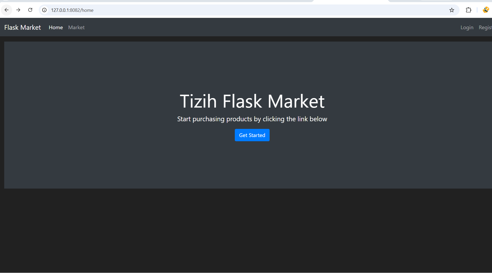
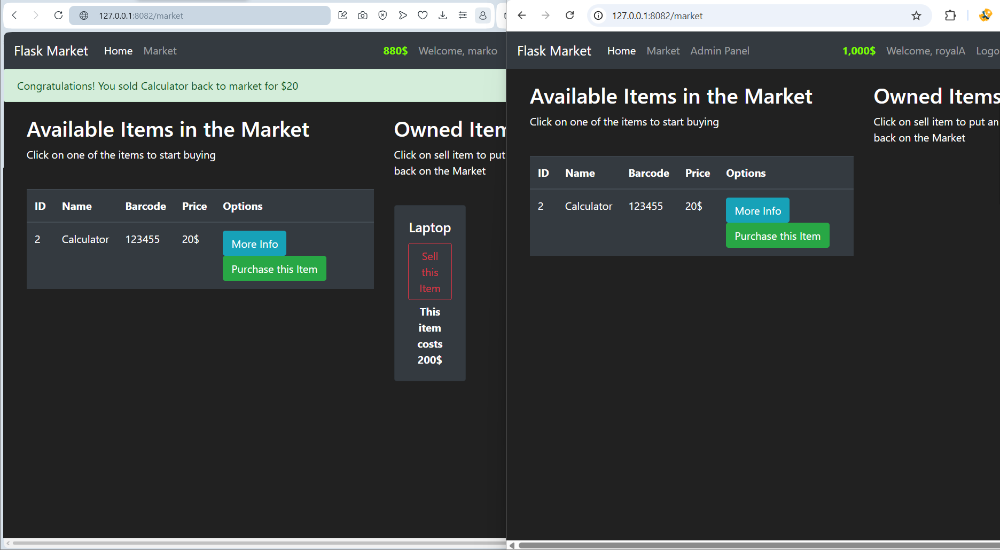
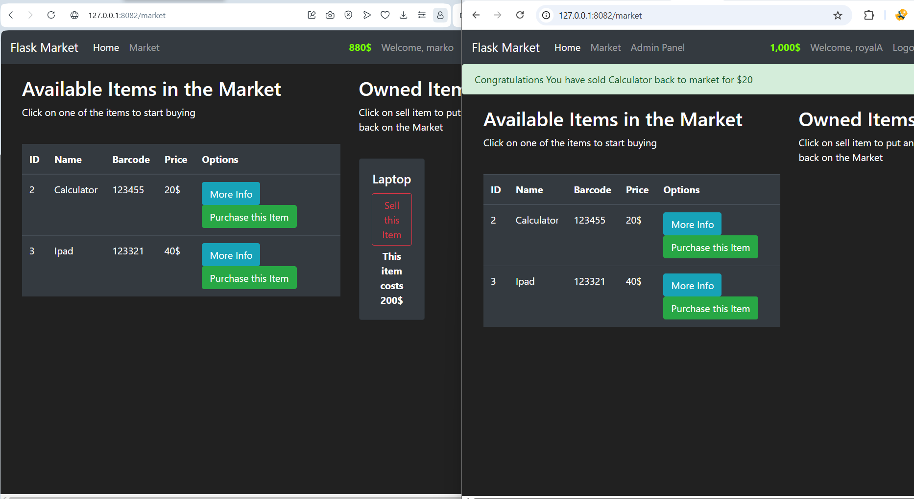
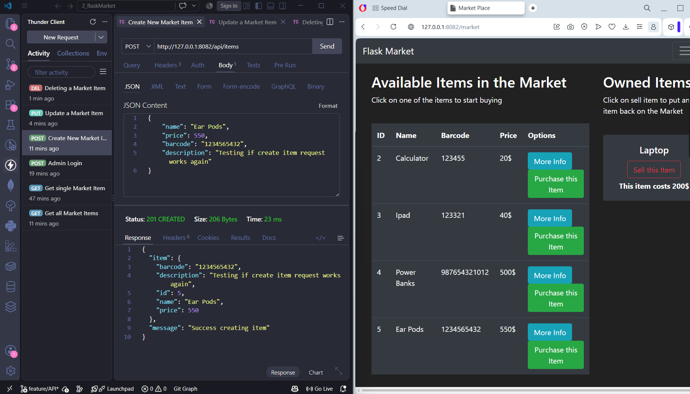
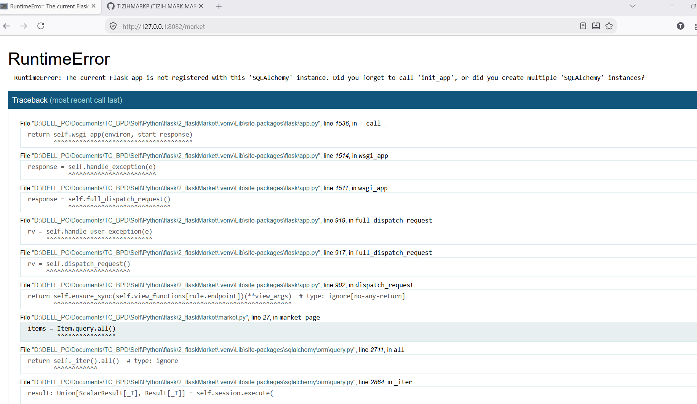
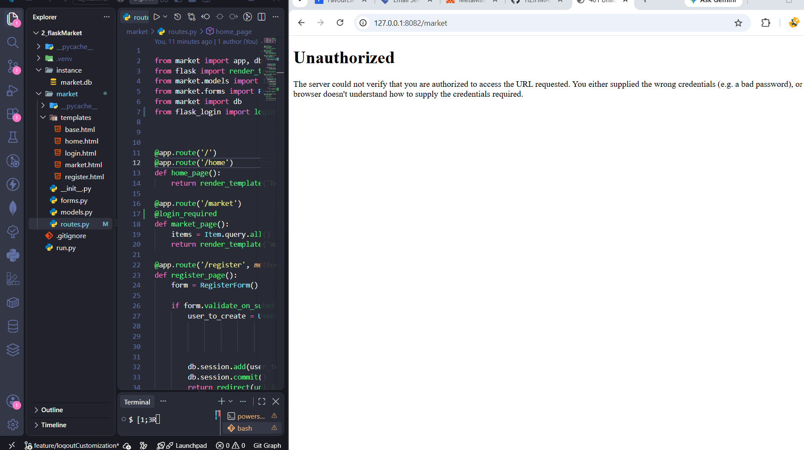

# Flask Market Application

This is a project based E-commerce marketplace web application built with Flask that allows users to buy and sell items, with admin capabilities for managing inventory.

## Overview

Flask Market is a web based marketplace where registered users can browse available items, purchase products, and sell their owned items back to the market. The application features a role-based access control system that distinguishes between regular users and administrators.

## Key Features

### User Features
- User registration and authentication system
- Secure password hashing using Bcrypt
- Session-based login management
- Personal budget tracking displayed on the navigation bar
- Browse available items in the market
- Purchase items with real-time budget updates
- Sell owned items back to the market
- View owned items in a dedicated section on the market page

### Admin Features
- Full CRUD operations for inventory management
- Create new items with name, price, barcode, and description
- View all items in the system with status indicators
- Update existing item details
- Delete items (with ownership validation)
- Admin dashboard accessible only to privileged users
- First registered user automatically receives admin privileges

### API Endpoints
The application provides RESTful API endpoints for programmatic access:

- `GET /api/items` - Retrieve all items
- `GET /api/items/<id>` - Retrieve a single item
- `POST /api/items` - Create a new item (admin only)
- `PUT /api/items/<id>` - Update an item (admin only)
- `DELETE /api/items/<id>` - Delete an item (admin only)
- `POST /api/login` - Authenticate and obtain session cookie

API authentication uses session based cookies, making it compatible with tools like Postman and Thunder Client after initial login.

## Technology Stack

- **Backend Framework**: Flask
- **Database**: SQLite with SQLAlchemy ORM
- **Authentication**: Flask-Login with Bcrypt password hashing
- **Forms**: Flask-WTF with CSRF protection
- **Frontend**: Bootstrap 4 with custom dark theme
- **Language**: Python 3.8+

## Screenshots

*The Home Page of the project showing available links for navigation*

*Market page showing clients and admin interface for managing items*

*Admin selling his own items which he purchased back to the market*

*API endpoints showing the CRUD operations of items by admin*

*Application process debugging of runtime errors*

*Debugging unAuthorized Erros Messages*

## Development Branches

The project was developed using a structured branching strategy:

- `main` - Production-ready code
- `develop` - Main development branch
- `feature/templateInheritance` - Base template implementation
- `feature/userAuth` - User authentication system
- `feature/forms` - Form handling and validation
- `feature/modelsRelationship` - Database relationships
- `feature/databaseInit` - Database initialization
- `feature/flashMessages_` - Flash message system
- `feature/itemPurchase` - Item purchasing logic
- `feature/itemSelling` - Item selling logic
- `feature/logoutCustomization` - Logout functionality
- `feature/CRUD` - Admin CRUD operations
- `feature/API` - RESTful API implementation

## Business Logic

### User Budget Management
- New users start with a budget of $1000
- Budget decreases when purchasing items
- Budget increases when selling items
- Real-time budget display on navigation bar
- Formatted budget display with comma separators

### Item Ownership Flow
1. Items are created by admin with `owner = None`
2. Items appear in the "Available Items" section
3. Users purchase items, transferring ownership
4. Purchased items move to "Owned Items" section
5. Users can sell items back, making them available again
6. Admin cannot delete items currently owned by users

### Purchase Validation
- Users must have sufficient budget
- Items must be available (not owned by someone else)
- Real-time validation with user feedback

### Sell Validation
- Users can only sell items they own
- Items return to available status after sale
- Budget is credited with the item price

## Admin Setup

The application implements a simple admin system where the first registered user automatically receives administrative privileges. This user can then:

1. Access the admin dashboard via the navigation bar
2. Create new items for the marketplace
3. Update existing item details
4. Remove items from the system
5. View comprehensive inventory statistics

## Security Features

- CSRF protection on all forms
- Password hashing with Bcrypt
- Session-based authentication
- Role-based access control
- Input validation on all forms
- SQL injection protection via SQLAlchemy
- Protected admin routes with decorators

## Error Handling

The application includes comprehensive error handling for:
- Insufficient funds during purchase
- Attempting to purchase unavailable items
- Selling items not owned by the user
- Duplicate item names and barcodes
- Invalid form submissions with user feedback
- Database transaction rollback on errors

## Future Enhancements

Potential improvements for future development:
- Item categorization and filtering
- Search functionality for items
- User purchase history
- Email notifications for transactions
- Image upload support for items
- Shopping cart system
- Order history tracking
- Discount and promotion system
- Pagination for large inventories
- User profile management

## License

This project is open source and available for learning and development purposes

---
 Tizih Mark-PrinceWill || Tizih Mark Marko || PrinceWill
`Last Update: 08/09/2026`